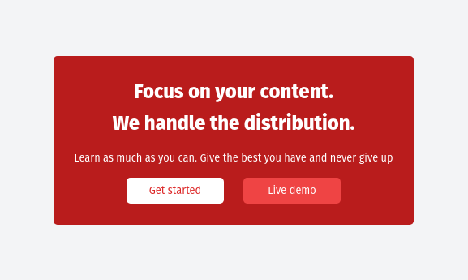

# Custom Theme HTML Landing Page
A beginner-friendly example of creating custom color themes with Tailwind CSS v4 using CSS variables and arbitrary values.

### 🎯 What You'll Learn

- How to create custom color variables in CSS
- Using CSS variables with Tailwind CSS arbitrary values
- Building a responsive landing page
- Implementing hover effects
- Working with Tailwind CSS v4

### 🎨 Preview
This project creates a modern landing page with:

- Custom red theme with white text
- Two interactive buttons with hover effects
- Clean, centered layout
- Responsive design

### ✅ Instructions
- Open the index.html file.

- Follow the comments and instructions inside to complete the challenge.

- If you need more guidance, visit the Tailwind CSS documentation:
👉 https://tailwindcss.com/docs/theme

### Final result : 

Happy Coding!

